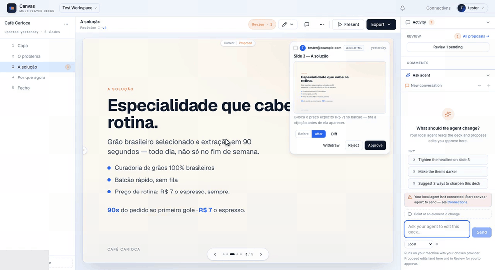

# 21x Canvas

Multiplayer editor for HTML decks, built for agents. The slide is the unit of collaboration: Claude Code, Codex, or any MCP-compatible agent proposes edits as diffs, and the team reviews, comments, and approves them in the browser. No server-side AI inference; everyone brings their own agent.



## How it works

1. **Import a deck** — paste or upload any HTML deck. The parser decomposes it into slides + theme and lifts inline base64 images out to Storage.
2. **Connect your agent** — mint a personal MCP token in Connections and point any streamable-HTTP MCP client at `/api/mcp`.
3. **Agents propose, humans approve** — every agent edit lands as a pending proposal with an inline diff. Nothing changes until someone approves it.
4. **Ship it** — export to self-contained HTML, PDF, or PowerPoint.

**Deeper docs:** [DESIGN.md](DESIGN.md) (why this exists, in one screen) · [CONTEXT.md](CONTEXT.md) (canonical vocabulary: Deck, Slide, Edit, Snapshot, MCP Token, …) · [docs/adr/](docs/adr/) (architectural decisions; [ADR-0004](docs/adr/0004-canvas-standalone.md) covers the standalone split, [ADR-0009](docs/adr/0009-agent-agnostic-clients.md) the agent-agnostic client model)

## Features

- **Auth** — Google + magic link, on a standalone Supabase project
- **3-pane editor** — slide list · live preview · activity rail (review, comments, Ask agent)
- **Proposals** — pending → applied / rejected, with inline diffs and a per-deck review queue. An optional deck-scoped trusted fast lane lets render-verified patches apply directly
- **Slide locks** — 15-minute soft locks warn when people or their agents converge on the same slide
- **Threaded comments** — pinned to a spot on the slide, with mentions and an in-app notification feed
- **Versioning** — every applied edit produces an immutable slide version; restores are forward-only
- **Snapshots** — named deck-wide cuts, cheap to create, auto-taken on export / share / restore
- **Connections** — per-user MCP tokens, plus in-app chat that runs through a local Claude Code / Codex bridge or a personal API key (OpenRouter, Anthropic, OpenAI)
- **Export** — self-contained HTML, PDF, and PowerPoint, with auto-snapshots and visible progress

## Quickstart

```bash
cd app
cp .env.example .env.local            # fill in the keys (see below)
npm install
npm run dev                           # http://localhost:3001
```

**Bring your own Supabase project:** create one, run every migration in [app/supabase/migrations/](app/supabase/migrations/) in order (`supabase db push` from `app/supabase/`, or paste each file into the SQL editor), then copy the URL + keys from the project's API settings.

### Environment (`app/.env.local`)

| Var | Notes |
|---|---|
| `NEXT_PUBLIC_SUPABASE_URL` | `https://<your-project-ref>.supabase.co` (browser-safe) |
| `NEXT_PUBLIC_SUPABASE_PUBLISHABLE_KEY` | Browser-safe `sb_publishable_...` |
| `SUPABASE_SECRET_KEY` | Server-only `sb_secret_...` — deck parser uploads, MCP token revocation, workspace creation. Never expose, never commit |
| `CANVAS_CREDENTIAL_ENCRYPTION_KEY` | Server-only base64 32-byte key (`openssl rand -base64 32`) that AES-256-GCM-encrypts saved personal API keys. Keep stable across deploys |
| `NEXT_PUBLIC_APP_URL` | `http://localhost:3001` locally; your public URL in prod |

`app/.env.example` is the source of truth for which vars are needed.

## Scripts

```bash
npm run dev             # next dev on :3001
npm run build           # next build
npm run lint            # eslint — must be clean before merging
npm run test            # vitest (parser, MCP server, RPC/RLS suite on in-process Postgres)
npm run e2e             # full path against live Supabase + a running dev server
npm run sweep-orphans   # delete Storage objects whose deck row no longer exists
```

`npm run e2e` needs `npm run dev` in another terminal plus `E2E_USER_ID` / `E2E_WORKSPACE_ID` pointing at a real user + workspace. It imports the seed deck from `app/tests/fixtures/seed-deck.html` (gitignored — drop in any full HTML deck), mints an MCP token, walks the JSON-RPC surface, exercises preview / asset / export, then cleans up after itself.

## Repository layout

```
├── README.md                       you are here
├── CONTEXT.md                      domain glossary — names of things
├── DESIGN.md                       why it exists, v1 success criteria
├── docs/adr/                       architectural decisions
├── bridge/                         canvas-agent — local bridge for in-app chat (Claude Code / Codex)
└── app/                            the Next.js app
    ├── AGENTS.md                   gotchas for AI coding assistants (Next 16, proxy.ts)
    ├── src/
    │   ├── proxy.ts                middleware (Next 16 renamed middleware.ts → proxy.ts)
    │   ├── app/                    (auth), api (preview / asset / export / mcp), canvases, settings
    │   ├── components/             shared UI + proposal diff / preview iframes
    │   └── lib/
    │       ├── auth/               server-action helpers + user resolution
    │       ├── canvas/             parser, assembler, MCP server, edit RPCs
    │       └── supabase/           ssr / browser / admin clients
    ├── supabase/migrations/        sequential — 0000 is the tenancy foundation, 0001+ are Canvas
    ├── tests/                      vitest specs + fixtures (tests/db runs migrations on in-process Postgres)
    └── scripts/                    e2e + maintenance
```

Vitest fixtures: `tests/fixtures/mini-deck.html` is the committed minimal deck; `seed-deck.html` and any `*.real.html` are gitignored so you can reproduce parser bugs against complex private decks.

## Next 16 gotchas

The app runs **Next 16.2 + React 19.2**, which breaks assumptions from older versions:

- Middleware lives in [app/src/proxy.ts](app/src/proxy.ts) and exports `proxy`, not `middleware`.
- Server Components are the default; client components must be marked explicitly.
- React 19's `react-hooks` lint rules treat setState-in-effect and refs-during-render as errors. Reset derived state with the "adjust state on prop change" pattern, not effects.

When in doubt, read the guides in `app/node_modules/next/dist/docs/` — see [app/AGENTS.md](app/AGENTS.md).

## Supabase notes

- Canvas tables live in `public` with the `canvas_*` prefix; tenancy tables (`workspaces`, `users`, `workspace_memberships`, `workspace_invites`) sit unprefixed — see migration 0000 and [ADR-0004](docs/adr/0004-canvas-standalone.md).
- Storage bucket `decks` holds deck assets under `assets/{deck_id}/...`.
- RLS everywhere via `public.is_workspace_member` / `public.is_workspace_admin_or_owner`. `public.workspaces` has no INSERT policy for `authenticated` — workspaces are created only through the service-role admin client.
- The MCP route resolves token → user/workspace and enforces deck access explicitly. Content writes are propose-first; the trusted fast lane is deck-scoped, patch-only, and requires render verification.
- Auth email branding: local templates live in `app/supabase/templates/` (wired by `app/supabase/config.toml`); mirror them in the hosted dashboard under Auth → Emails → Templates, since `config.toml` does not reach hosted projects.

## Deployment

Canvas is a standard Next.js app — any Node host works. Two things to wire up:

- Set `NEXT_PUBLIC_APP_URL` to your public URL; absolute links (auth emails, MCP install deeplinks) are built from it, not from request headers.
- Give Canvas its own OAuth client: add `https://<your-project-ref>.supabase.co/auth/v1/callback` to the client's redirect URIs, and add your app URL to Supabase Auth → Redirect URLs.

## Before you commit

1. `npm run lint` — clean
2. `npm test` — green
3. `npx tsc --noEmit` — clean
4. Touched migrations? Sanity-check the SQL against a real project before pushing — RLS is easy to break

## License

[MIT](LICENSE)
