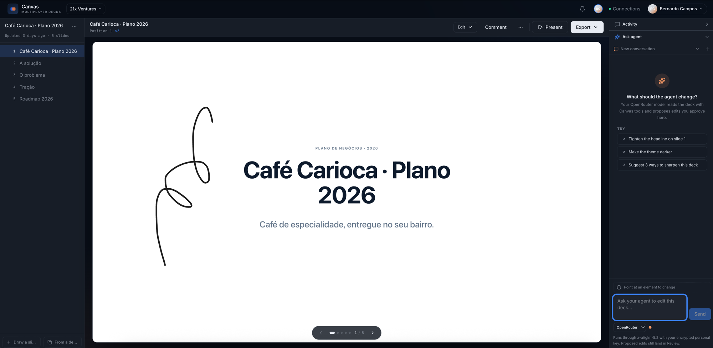

# 21x Canvas

Agent-agnostic multiplayer editor for HTML decks. Each slide can be owned by a user; Codex, Claude Code, or another MCP-compatible agent proposes edits as diffs the team reviews. Threaded comments and slide locks keep parallel work coherent. Canvas is standalone with its own Supabase project and auth; see [ADR-0004](docs/adr/0004-canvas-standalone.md) for the split and [ADR-0009](docs/adr/0009-agent-agnostic-clients.md) for the client model.



- **Why this exists, in one screen:** [DESIGN.md](DESIGN.md)
- **Canonical vocabulary (Deck, Slide, Edit, Snapshot, MCP Token, …):** [CONTEXT.md](CONTEXT.md)
- **Schema:** [app/supabase/migrations/](app/supabase/migrations/) (sequential; 0000 is the workspace tenancy foundation, 0001+ are Canvas-specific)

## What's in here today

- **Auth** — Google + magic link (standalone Supabase project, see [ADR-0004](docs/adr/0004-canvas-standalone.md))
- **Deck list, create / import** — paste or upload an HTML deck; the parser decomposes it into slides + theme + nav and lifts inline base64 images out to Storage
- **3-pane editor** — slide list / live iframe preview / right rail (comments + proposals + danger)
- **Slide locks** — 15-min soft lock; warns when people or their agents converge on the same slide
- **Proposals** — `canvas_deck_edit` rows with status `pending → applied | rejected`. Inline diff, slide-over sheet, and a per-deck/inbox view
- **Threaded comments** — top-level pinned to a slide (anchor at fractional x,y), replies thread under. Mentions stored as a uuid array
- **Versioning** — every applied edit produces a new immutable `canvas_slide_version`; the slide table's `html_body` / `slide_styles` / `title` are denormalized caches kept in sync by the apply-edit RPC. Restores are forward-only
- **Snapshots** — named deck-wide cuts (manual + auto on export / share / consolidate / pre-restore). Stored as theme/nav + a `(position → slide_version_id)` map; cheap to create
- **Connections** — per-user MCP tokens plus an optional personal OpenRouter key. Bearer `/api/mcp` works with streamable-HTTP MCP clients; in-app chat can use the local Codex/Claude bridge or OpenRouter per turn
- **Export** — HTML, PDF, and PowerPoint with auto-snapshots and visible render progress

## Local dev

```bash
cd app
cp .env.example .env.local            # fill in the keys (see below)
npm install
npm run dev                           # http://localhost:3001
```

### Required env vars (`app/.env.local`)

| Var | Notes |
|---|---|
| `NEXT_PUBLIC_SUPABASE_URL` | `https://<your-project-ref>.supabase.co` (browser-safe, not a secret) |
| `NEXT_PUBLIC_SUPABASE_PUBLISHABLE_KEY` | Browser-safe `sb_publishable_...` |
| `SUPABASE_SECRET_KEY` | Server-only `sb_secret_...`. Used by the HTML deck parser (uploads assets via service role), MCP token revocation, and the workspace-create server action (RLS blocks direct INSERT on `public.workspaces`). Never expose to the browser, never commit |
| `CANVAS_CREDENTIAL_ENCRYPTION_KEY` | Server-only base64-encoded 32-byte key (`openssl rand -base64 32`) used to AES-256-GCM encrypt personal OpenRouter API keys. Keep stable across deploys; never expose or commit |
| `NEXT_PUBLIC_APP_URL` | `http://localhost:3001` locally; `https://canvas.21xventures.com` in prod |

**Bring your own Supabase project:** create a project, run every migration in `app/supabase/migrations/` in order (`supabase db push` from `app/supabase/`, or paste each file into the SQL editor), then copy the URL + keys from your project's API settings. `app/.env.example` is the source of truth for which vars are needed.

## Scripts

```bash
npm run dev             # next dev on :3001
npm run build           # next build
npm run start           # next start on :3001
npm run lint            # eslint (next config) — must be clean before merging
npm run test            # vitest run (parser + MCP server unit tests)
npm run test:watch      # vitest watch
npm run e2e             # full path against live Supabase + dev server (see below)
npm run sweep-orphans   # delete Storage objects whose deck row no longer exists
```

### `npm run e2e`

End-to-end exercise of the full Canvas v1 path against a live Supabase project. Requires `npm run dev` running in another terminal, plus `E2E_USER_ID` and `E2E_WORKSPACE_ID` set to a user + workspace that exist in your project. Imports the seed deck at `app/tests/fixtures/seed-deck.html` (gitignored — drop in any full HTML deck), mints an MCP token for the test user, walks the JSON-RPC surface, fetches preview / asset / export endpoints, then cleans up everything it created. Source: [app/scripts/e2e-canvas.mts](app/scripts/e2e-canvas.mts).

### `npm run sweep-orphans`

One-shot maintenance — lists every object under the `decks` bucket and deletes any whose `deck_id` path segment has no matching `canvas_deck` row. Safe to run repeatedly. Source: [app/scripts/sweep-orphans.mts](app/scripts/sweep-orphans.mts).

## Directory layout

```
21x-canvas/
├── README.md                       you are here
├── CONTEXT.md                      domain glossary — names of things
├── DESIGN.md                       why it exists, v1 success criteria
├── docs/adr/                       architectural decisions (planned)
└── app/                            the Next.js app
    ├── AGENTS.md                   gotchas for AI coding assistants (Next 16, proxy.ts)
    ├── CLAUDE.md                   includes AGENTS.md
    ├── src/
    │   ├── proxy.ts                middleware (Next 16 renamed `middleware.ts` → `proxy.ts`)
    │   ├── app/
    │   │   ├── (auth)/             login flow
    │   │   ├── api/                preview, asset, export, mcp routes
    │   │   ├── canvases/           list, new, [id] editor, inbox, history, proposals
    │   │   └── settings/mcp/       per-user MCP token issuance
    │   ├── components/             shared UI + proposal-diff / proposal-iframe
    │   └── lib/
    │       ├── auth/               server-action helpers + user resolution
    │       ├── canvas/             parser, assembler, mcp server, edit RPCs
    │       └── supabase/           ssr / browser / admin clients
    ├── supabase/migrations/        0001 schema → 0005 proposals
    ├── tests/                      vitest specs + fixtures
    └── scripts/                    e2e + sweep-orphans
```

## Tests + fixtures

Vitest covers the deck parser and the MCP server. `tests/fixtures/mini-deck.html` is the committed minimal fixture; `tests/fixtures/seed-deck.html` (a larger real-world deck) is **gitignored** — drop in any full HTML deck if you want to run the e2e or reproduce parser bugs against a complex layout. Any `*.real.html` you drop into `tests/fixtures/` is similarly gitignored.

## Next 16 gotchas

This app runs on **Next 16.2 + React 19.2**, which has breaking changes vs. anything older. The most likely-to-trip-you-up ones:

- Middleware lives in [app/src/proxy.ts](app/src/proxy.ts), not `middleware.ts`. The exported function is `proxy`, not `middleware`.
- Server Components are the default; client components must be explicitly marked.
- React 19's `react-hooks` lint rules are stricter — setState in effects and refs-during-render are errors, not warnings. Use the "adjust state on prop change" pattern (track previous prop, compare during render) rather than effects when resetting derived state.

When in doubt about an API, read the relevant guide in `app/node_modules/next/dist/docs/` before writing code. See [app/AGENTS.md](app/AGENTS.md).

## Supabase

- **Project:** bring your own Supabase project (the reference deployment is named `canvas-prod`)
- **Region:** `us-east-1`, Postgres 17
- **Schema:** Canvas tables live in `public` with the `canvas_*` prefix (not a separate Postgres schema — avoids the "exposed schemas" config step in Supabase Studio). Tenancy tables (`workspaces`, `users`, `workspace_memberships`, `workspace_invites`) sit in `public` without a prefix; they're a verbatim port of the workforce-management foundation — see migration 0000 and [ADR-0004](docs/adr/0004-canvas-standalone.md).
- **Storage bucket:** `decks` (created by migration 0003; assets under `assets/{deck_id}/...`)
- **Migrations:** apply in order via `supabase db push` from the `app/supabase/` directory, or pasted into the dashboard SQL editor. They're idempotent enough that re-applying is generally safe, but read the file before you do
- **RLS:** every Canvas table uses `public.is_workspace_member` / `public.is_workspace_admin_or_owner`. `public.workspaces` has **no INSERT policy for `authenticated`** — workspaces are created only via the service-role admin client (`createWorkspaceAction` in `src/lib/auth/actions.ts`)

The MCP route resolves token → user/workspace and then enforces deck access explicitly. Content writes are propose-first; the optional trusted fast lane is deck-scoped, patch-only, and requires render verification.

## Production

- **Domain:** `canvas.21xventures.com` (DNS / hosting TBD — Vercel likely)
- **Auth callback:** Canvas uses its own OAuth client. Wire `https://<your-project-ref>.supabase.co/auth/v1/callback` into that client's redirect URIs, and put your production app URL into Supabase Auth → Redirect URLs.

## Before you commit

1. `npm run lint` — clean
2. `npm test` — green
3. `npx tsc --noEmit` — clean
4. If you touched migrations, sanity-check the SQL against the dashboard before pushing (RLS is easy to break)
